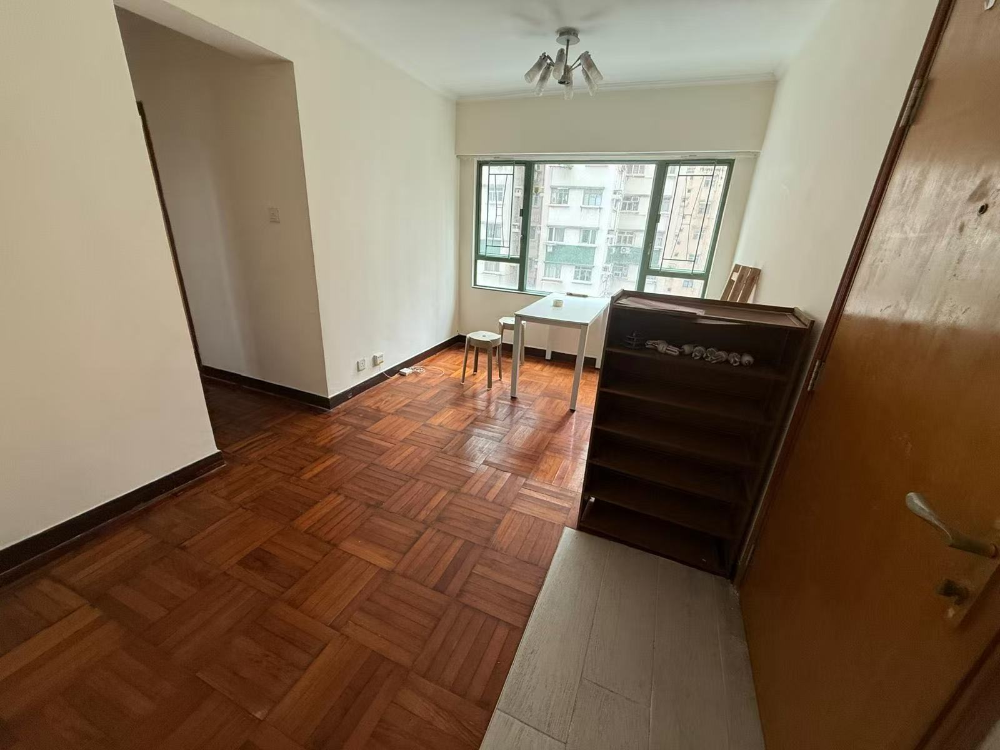
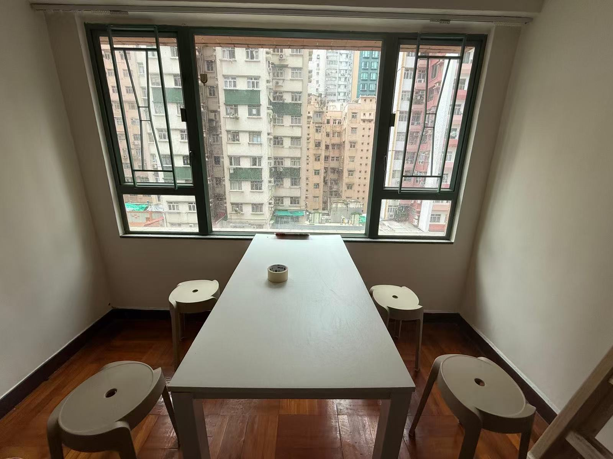
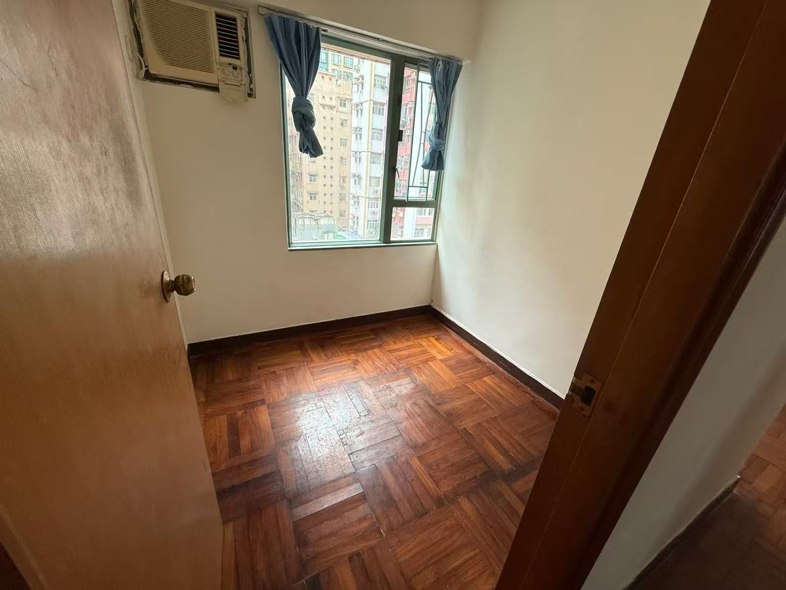
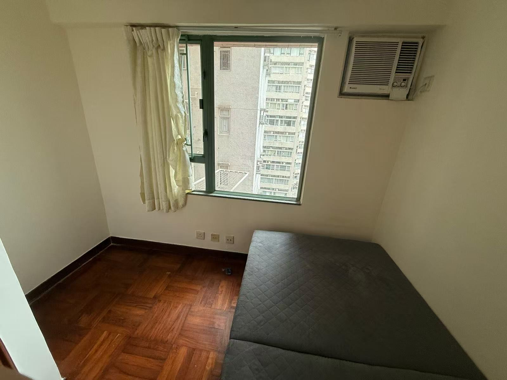
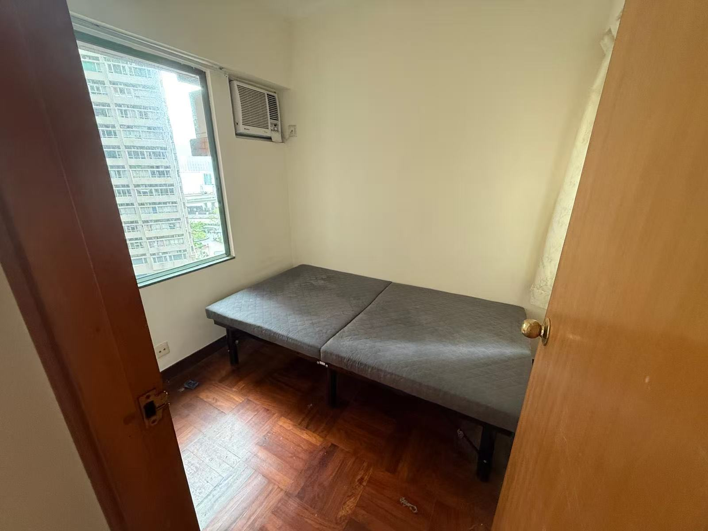
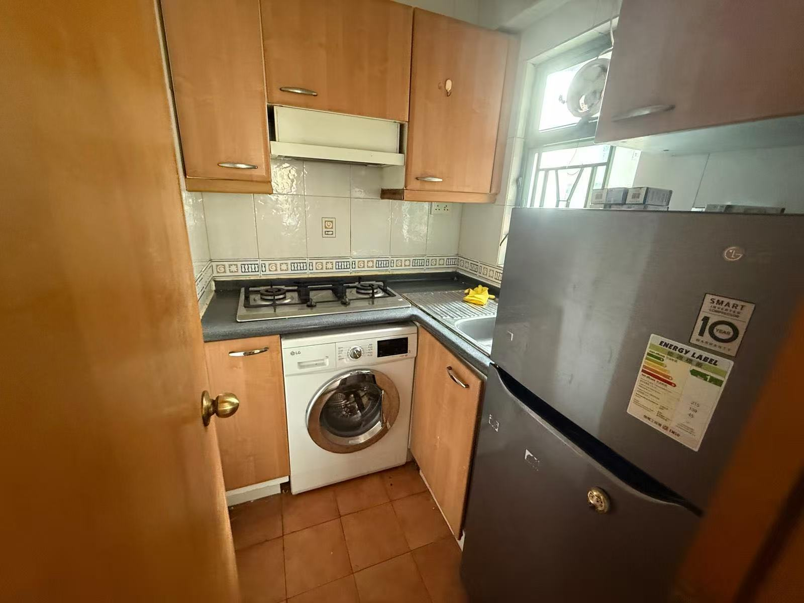
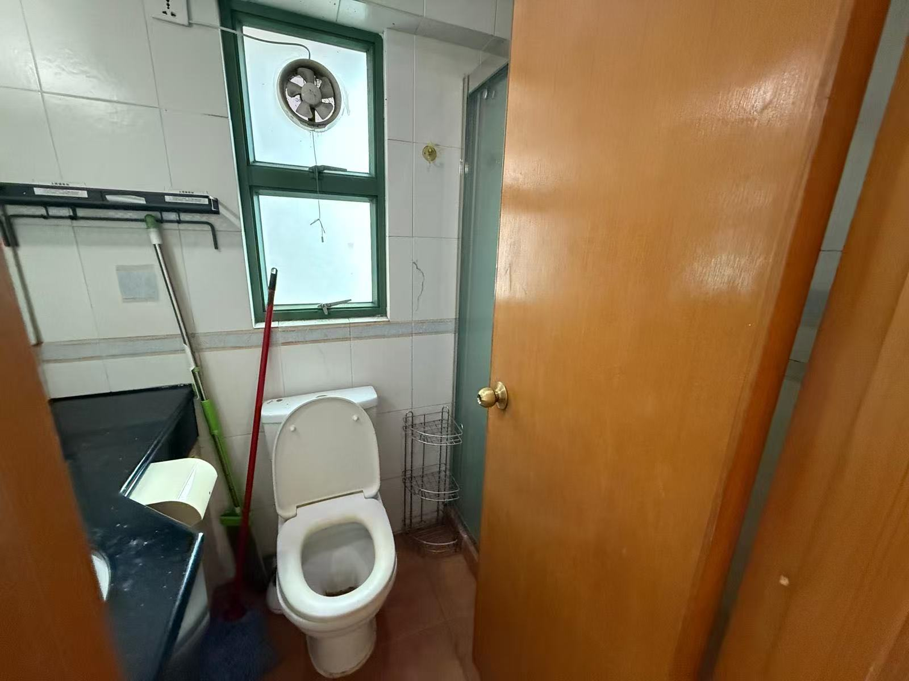
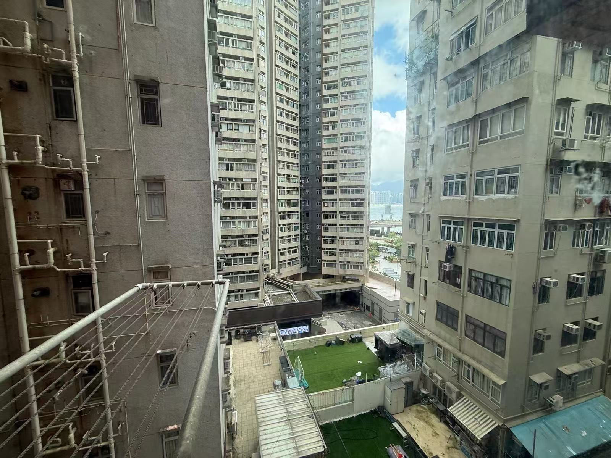
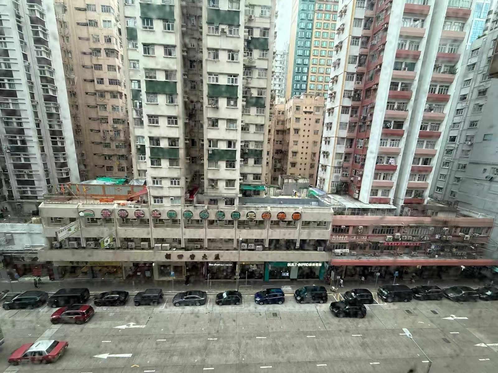

【北角-1】北角/炮台山 🇭🇰盈富閣700万3房 25年楼龄 高性价比
实用面积：673呎
建築面積：700呎
楼龄：25年
楼层：楼层8B
电梯：有平地电梯（2部客用电梯）
户型：3房
管理费：约 $3.4-4.6 /呎 / 月（按实用面积计算）
电梯:1 座 2 部载客电梯
樓契：75年可续期
设施：小区配有儿童游乐场 / 游戏室、健身室、健康舞室等
地铁：步行约4分钟北角地铁站
校网：14东区优质校网
周边：步行可达北角汇商场、皇都商场（即将落成）、东区海滨长廊
大厦：1 座单幢住宅，25 层 (不包括地下)，每层 2-3 户，共 42 个单位
小区：盈富閣位于香港北角渣华道 55 号（北角 / 炮台山交界）

