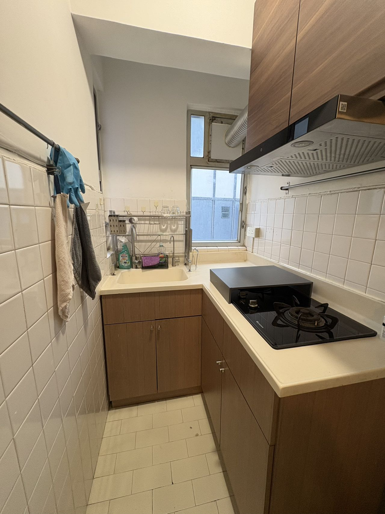
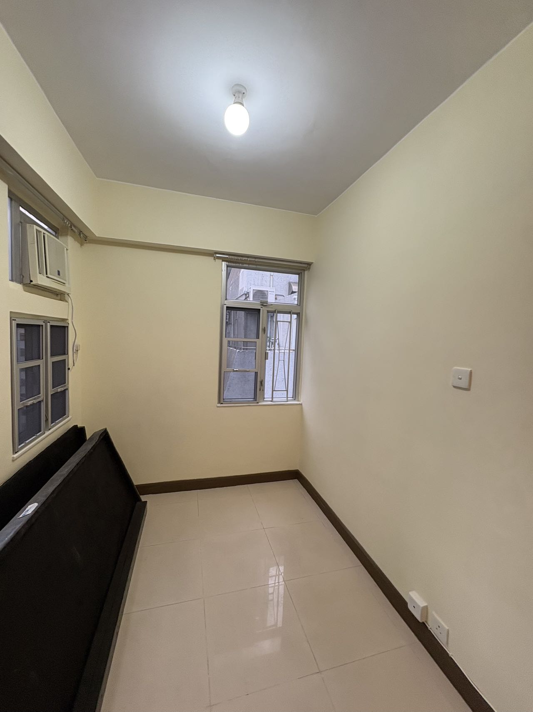
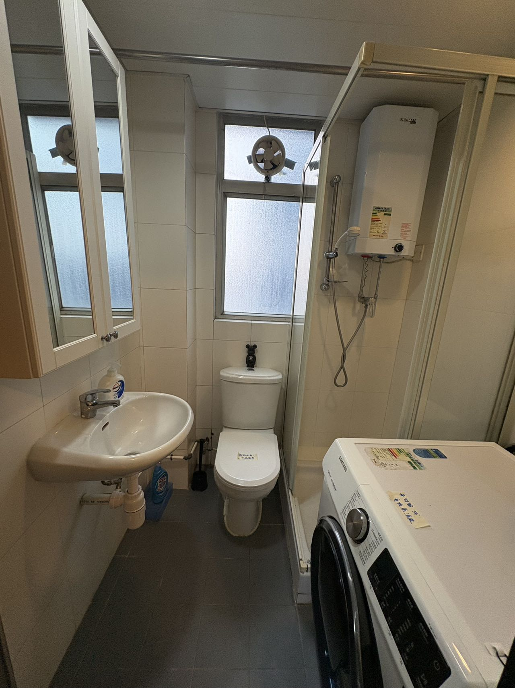

【湾仔-3】灣仔🇭🇰筍盤 $440萬 （現一房 🉑間兩房） 平地電梯 交通方便 🈶少少海景
实用面积：332呎
单位呎价：13253$/呎
楼龄：50年
电梯:有電梯（平地電梯🛗✅😄）
樓層：20樓
户型：現一房 🉑間兩房 
樓契：99➕99年
地铁：銅鑼灣/會展地鐵口6min左右（雙地鐵🚇）
大厦：積福大廈，位于灣仔謝斐道415-421號，总共68伙
交通方便、管理完善、業主友好👍🏠🍀
最大卖点：
（1）“铜锣湾+湾仔双核心交界”，铜锣湾3分钟生活圈、湾仔5分钟办公圈、中环/金钟10分钟通勤
（2）好出租，租客结构为外派白领、金融/保险从业者、单身专业人士，空置率通常较低
（3）铜锣湾核心地段低总价上车盘
备注：楼龄较大，银行按揭不一定能做到30年。
#積福大廈（有少少海景🌊🏠🌴😄）

