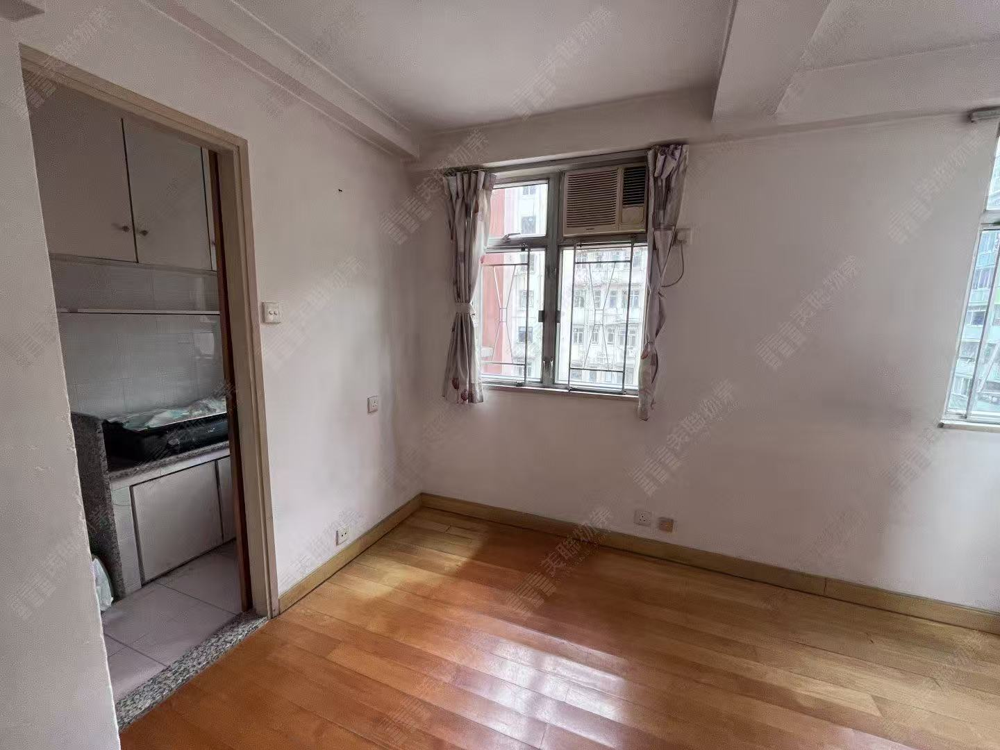
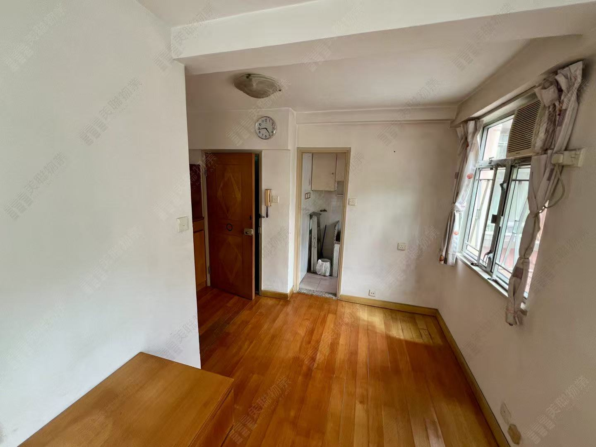
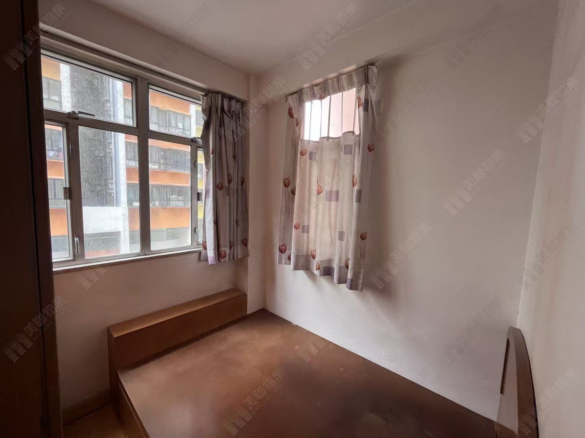
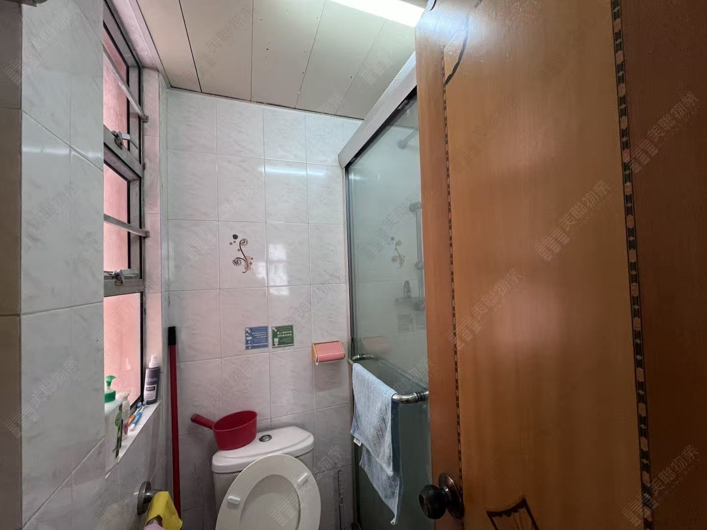
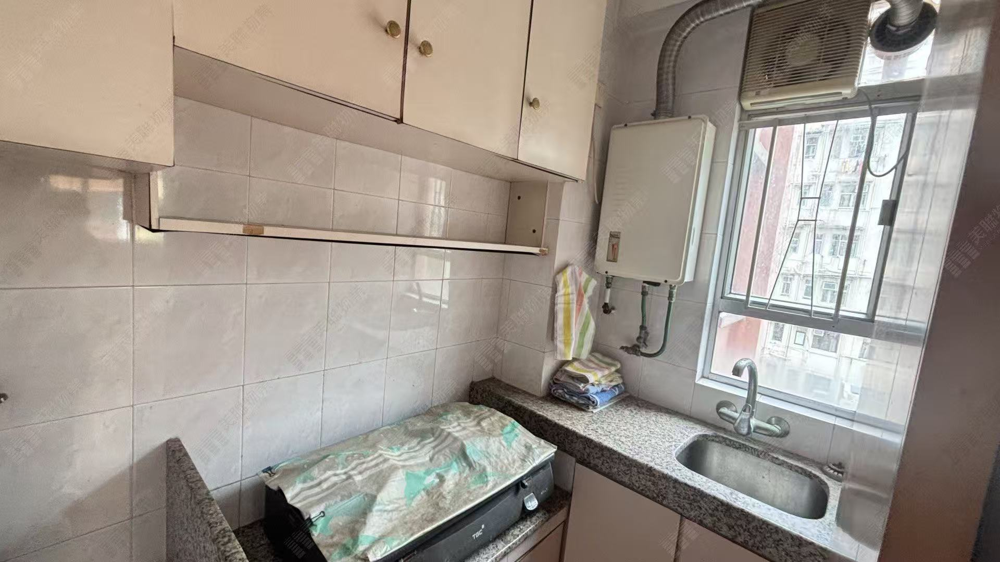
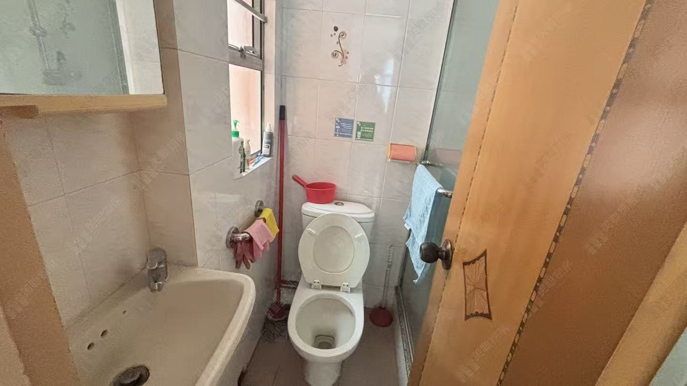
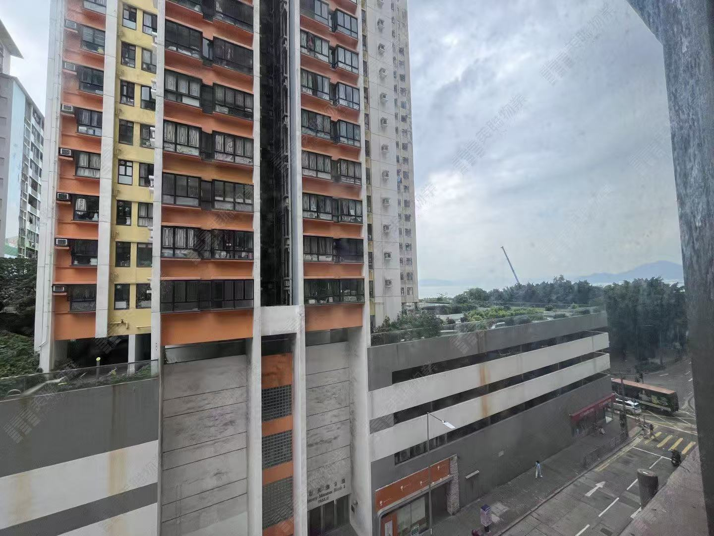
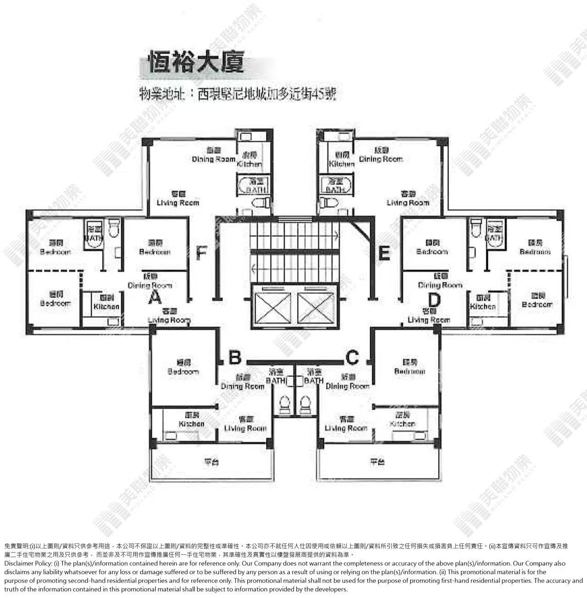

【西营盘-12】恒裕大厦 (HAN YU BUILDING）🇭🇰 1房$418萬 高性价比🏠
实用面积：257呎
楼龄：45年
电梯:  有電梯（平地電梯/配备3部客梯/直达地面大堂）
樓層：6楼 C室🧧🧧🎉🎉
管理费：$2.5-2.7/呎/月
户型：标准1房（梗厨）传统户型设计
校网：港岛中西区11校网（港岛女校最强校网）
交通：步行约 3分钟至港铁坚尼地城站🚉，步行约 10 分钟到海滨长廊，步行15 分钟到香港大学
大厦：恒裕大厦 位于香港坚尼地城加多近街 45-55 号（单幢式大厦）；1 座单幢式大厦，共136个单位
周边配套：楼下有便利店、小型超市，5 分钟内可达坚尼地城街市、超市、银行、诊所等生活配套

