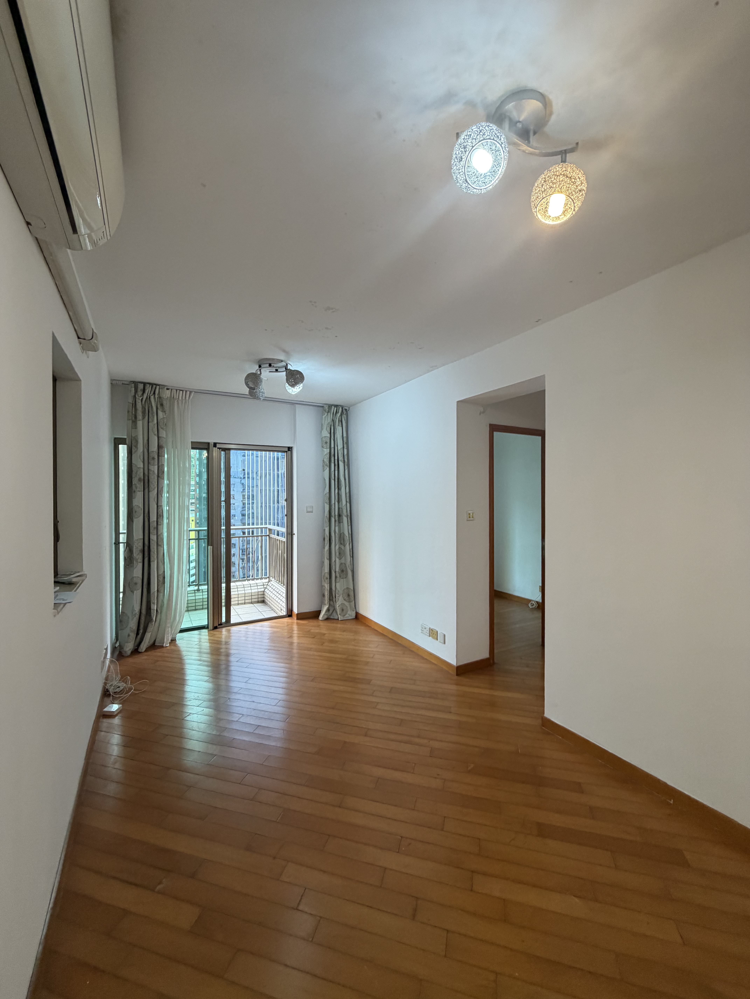
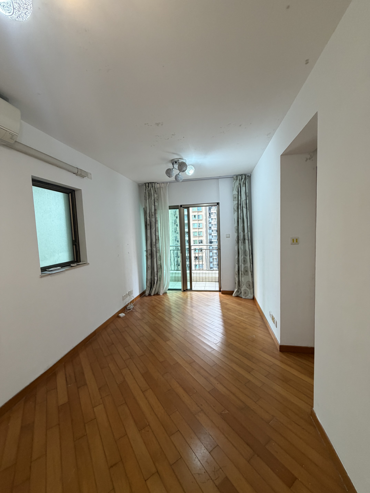
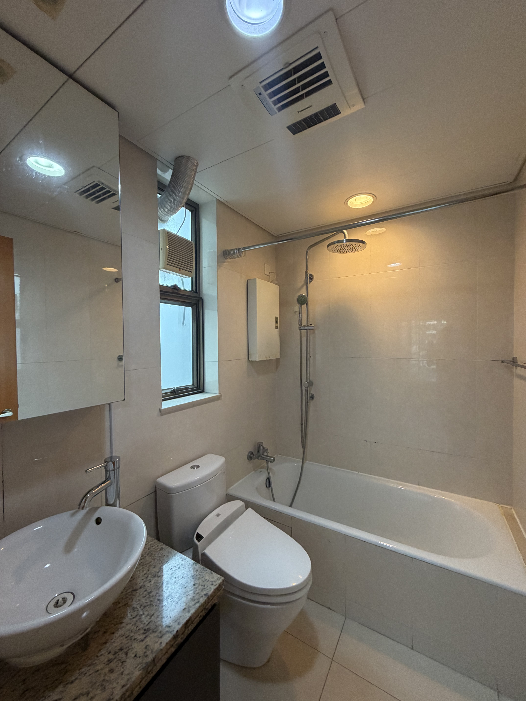
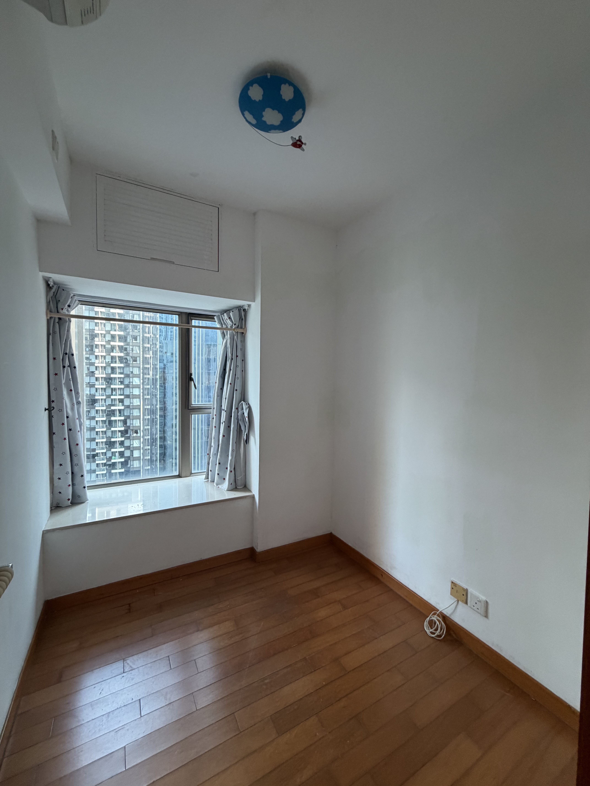
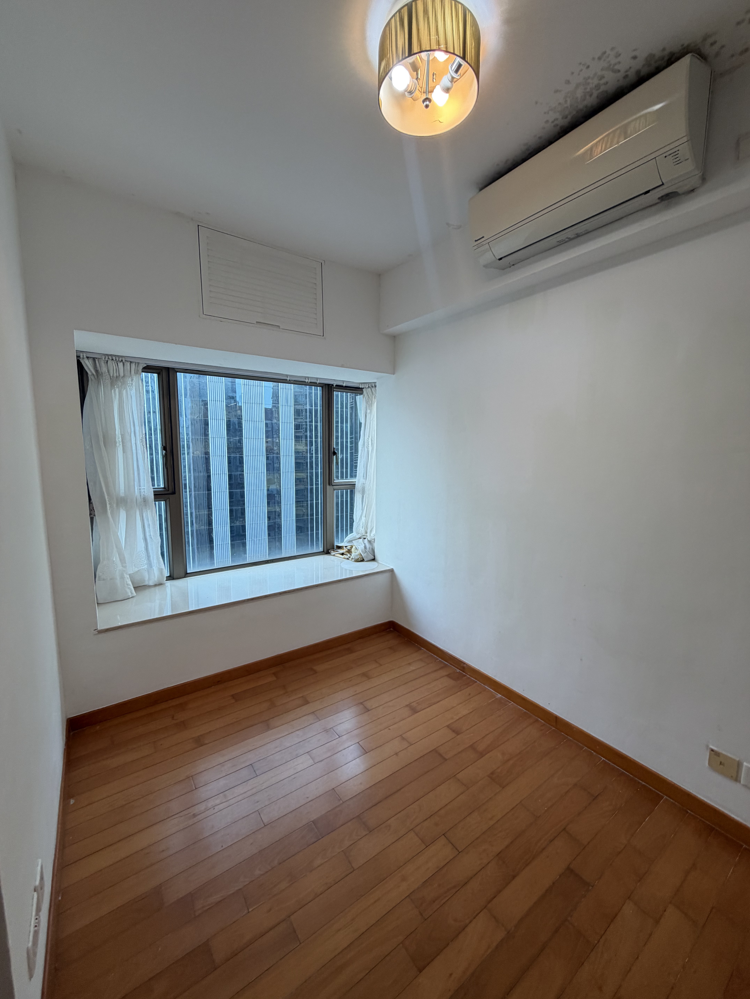
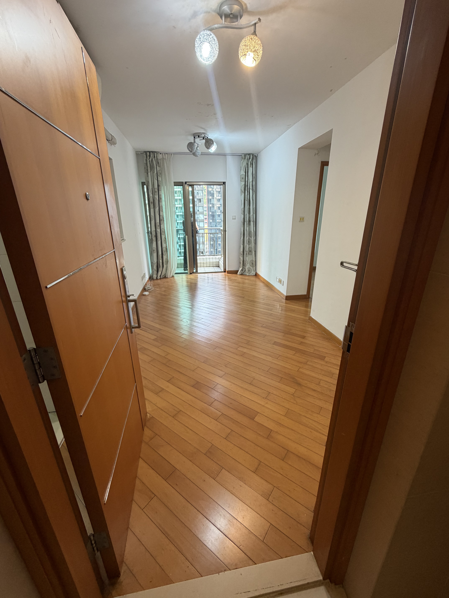

灣仔尚翘峰$1200萬 次新樓 兩房 有露台 有泳池🏊
实用面积：484呎
建筑面积：641呎
放租：$32000
楼龄：19年
电梯:平地電梯🛗
会所：健身室、宴会厅、烧烤场、儿童游乐场、泳池、平台花园
开发商：华人置业与市区重建局合作发展
伙数：共3座大厦，652个单位
樓層：22樓F
地铁：灣仔地鐵口3min左右
校网：12校网
小区：尚翘峰3座22F，3座皇后大道東258號,

